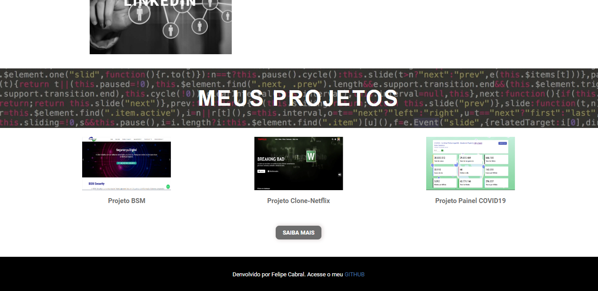

## Menu Hamburguer

Desafio de Projeto.

###### DESCRIÇÃO

Nesse projeto você aprenderá os mais importantes tópicos para alavancar no mundo das animações utilizando CSS. Dentre eles o CSS Transitions utilizando pseudo elementos e pseudo classes e também CSS @keyframes. Ao fim do projeto, teremos a construção de um portfólio apenas utilizando HTML e CSS para fixação das aulas.

Tecnologias e ferramentas utilizadas:

- HTML5
- CSS3
- Photoshop
- Visual Studio Code

**GitHub Pages**

Confira como ficou o projeto:

Link: https://felipecabraloliveira.github.io/menu-hamburguer/

### Página

**Banner inicial com efeito Parallax.**

**Cards de informação:**

**Cards de Projetos** - Efeito Parallax aplicado no título.

**Menu**

#### Responsividade

> Instrutor: Gabriela Pinheiro

> Bootcamp TQI Fullstack Developer
